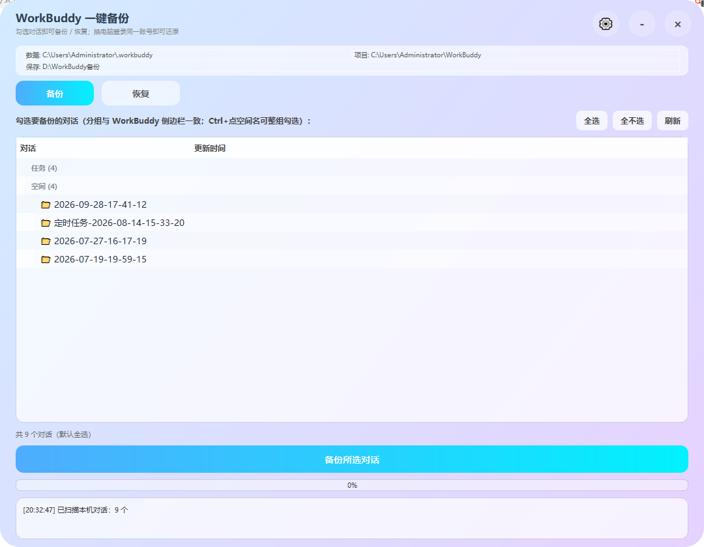
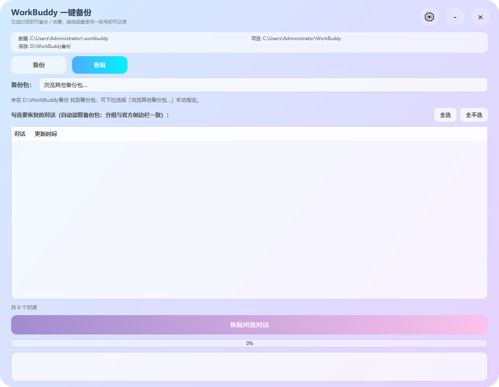
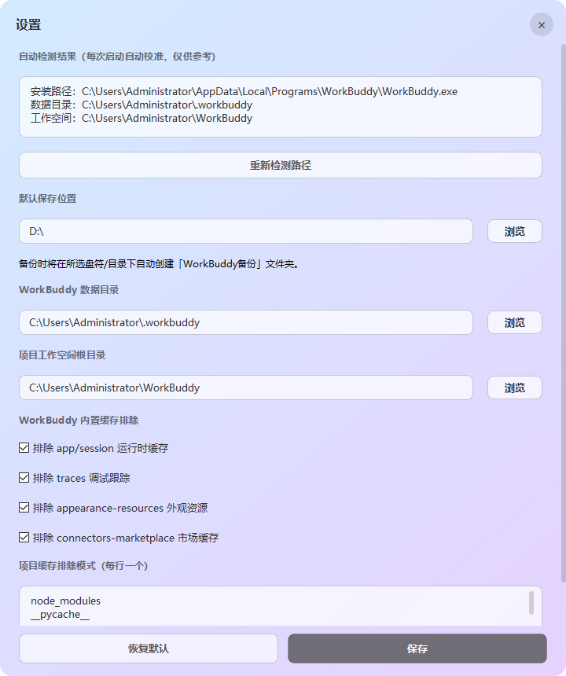

# WorkBuddy 一键备份

> Windows 桌面工具：把 WorkBuddy 的**对话记录**和**项目源代码**一键打包备份，换电脑后一键恢复，登录同一账号即可无缝继续使用。

## ✨ 核心能力

- **单文件 exe**，无<u>需安装、无需 Python 环境，双击即用</u>
- <u>对话列表</u>**<u>按 WorkBuddy 官方侧边栏方式分组</u>**<u>（「任务」/「空间」），只显示未删除对话</u>
- **一键备份**：对话正文 + 自动化任务 + 项目源代码
- **换电脑恢复**：全表合并（对话、自动化任务、空间登记、对话快照），路径自动改写
- 自动搜索备份包、相对时间显示、启动画面、桌面不产生任何文件

---

## 📦 下载与运行

1. 下载 **`WorkBuddyBackup.exe`**（约 39 MB）
2. 双击运行（Windows 若提示安全警告：选「更多信息 → 仍要运行」）
3. 首次启动**自动检测** WorkBuddy 数据路径，无需手动配置
4. 点右上角 `×` 可选择「退出程序 / 最小化到托盘」

> 启动会显示几秒「正在启动」画面，属正常现象（单文件 exe 需解压自身）。

---

## 🚀 使用方法一：备份（本机 → 备份包）

1. 打开软件，默认进入「**备份**」页
2. 列表自动列出本机对话，分组与官方侧边栏一致：
   - **任务 (N)**：不属于任何空间的对话
   - **空间 (N)**：WorkBuddy 中打开过的项目空间，空间下是该项目下的对话
3. 勾选要备份的对话：

| 操作            | 效果            |
| ------------- | ------------- |
| 点对话复选框 / 点对话名 | 勾选或取消该对话      |
| 点空间名          | 收起 / 展开该空间    |
| `Ctrl` + 点空间名 | 整组勾选 / 取消全部对话 |
| 「全选」「全不选」     | 一键全部勾选或取消     |

1. 点「**备份所选对话**」→ 保存到 `D:\WorkBuddy备份\WorkBuddy备份_日期时间.zip`

备份包内含：对话索引、对话正文、**自动化任务配置**、空间登记、对话快照，以及勾选对话所属项目的**全部源代码**。

> 建议先完全退出 WorkBuddy 再备份，避免文件被占用跳过；程序会自动做数据库 checkpoint，尽量保证包含最新对话。

---

## 🚀 使用方法二：恢复（备份包 → 新电脑）

1. 新电脑安装 WorkBuddy 并**登录同一账号**
2. **完全退出 WorkBuddy**（托盘也要退出）
3. 打开本软件 →「**恢复**」页
4. 软件**自动搜索并加载最新备份包**；也可在下拉框选择其他包，或点「浏览其他备份包…」手动指定
5. 勾选要恢复的对话（操作方式同备份页）
6. 点「**恢复所选对话**」→ 完成后**重启 WorkBuddy**

恢复内容：对话记录与正文、自动化任务、空间登记、对话快照、对应项目的源代码；旧用户名 / 旧工作区路径自动改写成新电脑路径。恢复前会自动把当前数据库备份为 `.bak` 文件。

---

## ⚙️ 设置（点右上角 ⚙️）

| 设置项              | 含义                                                        |
| ---------------- | --------------------------------------------------------- |
| 备份保存位置           | 备份包（zip）存到哪，默认 `D:\WorkBuddy备份`                           |
| WorkBuddy 数据目录   | 对话索引、自动化任务、设置所在目录，默认 `C:\Users\你\.workbuddy`，一般不用改        |
| 项目工作空间根目录        | 所有源代码所在目录，默认 `C:\Users\你\WorkBuddy`，一般不用改                 |
| WorkBuddy 内置缓存排除 | 可自动重建的缓存（运行时缓存、调试跟踪、外观缓存、市场缓存），排除后备份更小更快                  |
| 备份源代码时跳过的文件夹     | 依赖/构建产物目录（node_modules、build、dist 等），可重新生成；**你写的源代码不受影响** |

点「**重新检测**」会自动扫描并直接填入检测结果。

---

## 🖥 界面说明

- **时间显示**：`24天前（2026年9月28日19:43:31）` —— 相对时间 + 括号内完整时间
- **任务 / 空间**：与官方侧边栏完全一致，只显示未删除对话
- 透明渐变界面，可拖拽边缘缩放，托盘常驻

---

## ⚠️ 注意事项

1. 恢复前必须**完全关闭 WorkBuddy**，否则数据可能损坏（软件会强制拦截）
2. 换电脑恢复前提是**登录同一 WorkBuddy 账号**
3. 日志与配置在 `%LOCALAPPDATA%\WorkBuddyBackup`，**不会写到桌面**
4. 备份包建议同时拷贝到移动硬盘 / 网盘留存

---

## ❓ 常见问题

**Q：桌面图标还是旧的？**  
A：Windows 图标缓存问题，桌面按 F5 刷新或注销重新登录即可。

**Q：启动时有个"正在启动"画面？**  
A：正常，单文件 exe 每次启动需解压自身（约几秒），用启动画面避免看起来"点了没反应"。

**Q：会不会把桌面搞乱？**  
A：不会，所有程序生成文件都写入 `%LOCALAPPDATA%\WorkBuddyBackup`。

**Q：备份/恢复时闪一下黑框？**  
A：已修复，不会再现。

---

## 🛠 技术栈

Python 3 + PyQt6，PyInstaller 单文件打包（含启动画面与自定义图标）。
